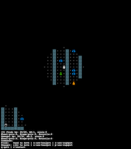

# MiniDungeon

**MiniDungeon** is a Rogue-like game, played by one or two players, played in a (simple) mazein an NxN world. The world is tiled where a player can only move from one tile to another. The tiles are arranged to form a square world, from tile (0,0) to tile (N-1,N-1). The tiles on the border of this world are always walls to prevent players from going off the world.

The first player is called Frodo. In a multi-player setup, there is a second player called Smaegol. They can play cooperatively, or competitively. The game is turn-based, where at every turn a player moves, then all the monsters move. The other player remains idle during this turn. The game engine does not in itself limits players to move in a strict alteration. The game does not support a distributed-mode, so both players have to play on the same computer, using e.g. one keyboard for each.

The game has one or more mazes (configurable). From the starting maze a player can go to the next one by using a _shrine_. The shrine can only be used if it has been _cleansed_.
It can be cleansed by applying a specific _scroll_ on it, though the player does not know which scroll would cleanse a shrine. Once cleansed, using it will teleport the player
to the next maze. Cleansing the shrine in the final maze wins the game for the player.

Monsters are randomly placed in the dungeon. When a monster is adjacent to a player, it will attack the player. Similarly, a player can attack an adjacent monster (or
another player). If a monster's hp reaches 0, it will be removed from the dungeon.
If the player's hp reaches 0 the player dies and cannot participate in the game anymore. If both players die, the game ends; the monsters win.

|  MD instance with lots of monsters |
|--|
||

There are _scrolls_ and _potions_ randomly dropped in the dungeon. When the player moves to a tile with an item on it, and provided there is still some space in the player's bag, the item is picked and automatically placed in the  bag. Frodo's bag can hold two items. Smeagol has a smaller bag that can only hold one item.

   * Shrines are tainted, and must be cleansed by using a scroll. However, only a holy scroll can do this. The player does not know up front which scroll is holy until it uses it. Using a scroll consumes it.

   * The player can use a potion, if his/her bag contains one. Using a heal potion heals the player for some amount of health point. Using a rage potion double its attack rating for some turns.

### How to run the game

Just run the class `DungeonApp`. It has a `main()` method.

You can configure how many mazes you have, how many monsters, how many healing potions, and so on. The code in the `main()` shows how to configure the game.

### Controls:

  * *Movements*: wasd-keys for Frodo, and ijkl-keys for Smaegol.
  * *Using items: e/r for Frodo (using a heal-pot or a rage-pot); o/p for Smaegol.
  * *Quit*: q

### Other screenshots:

| An instance with a twisting maze |
|--|
|  |

| An instance with a large maze |
|--|
|  |

| Imposing limited visibility |
|---|
|  |

#### Author

Wooshrow

#### License

3-clause BSD
